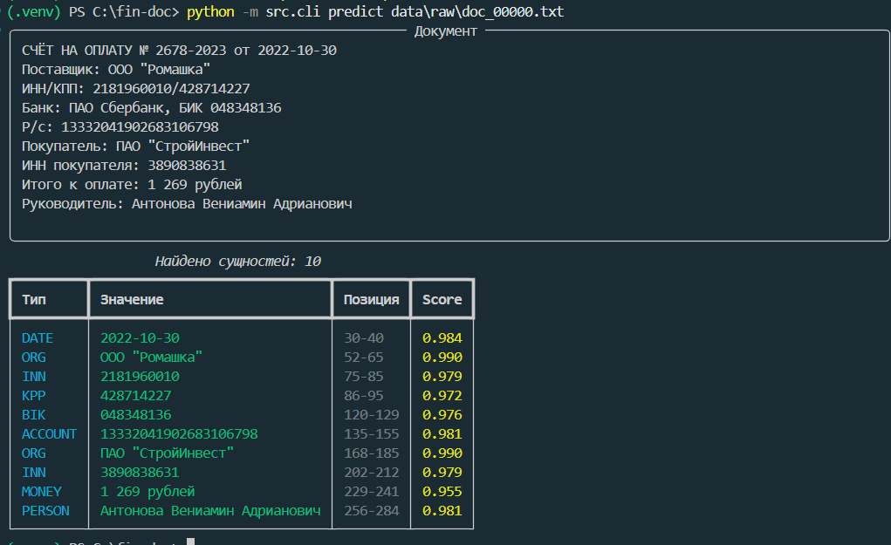
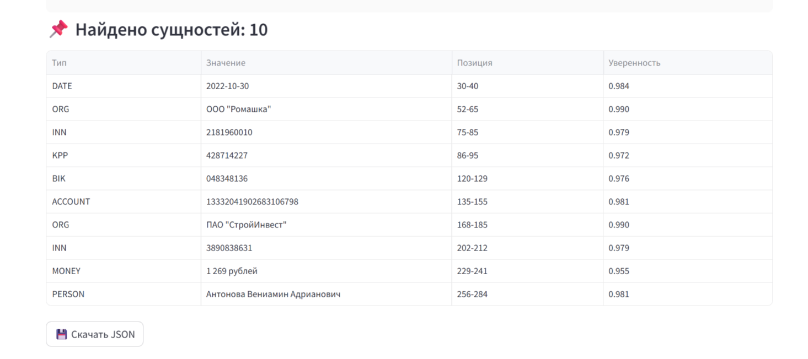
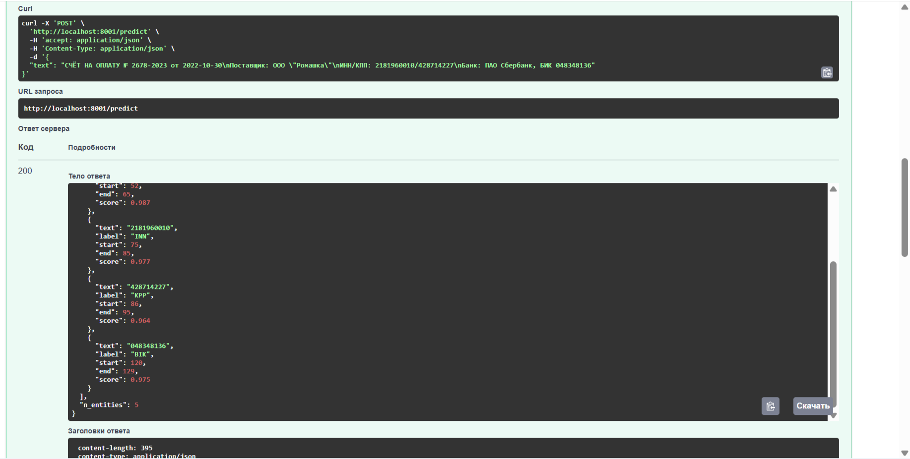

# 🏦 NER для финансовых документов

Извлечение 10 типов сущностей из платёжек, договоров и счетов на русском языке.
Гибрид: **rubert-tiny2** + **проверка контрольных сумм** ИНН/ОГРН/БИК.


---

## Что делает

```
Вход:  "ИНН/КПП: 2181960010/428714227, ООО \"Ромашка\", сумма 1 269 ₽"

Выход: INN     | 2181960010
       KPP     | 428714227
       ORG     | ООО "Ромашка"
       MONEY   | 1 269 ₽
```

**Сущности:** `ORG` `PERSON` `MONEY` `DATE` `INN` `OGRN` `KPP` `BIK` `ACCOUNT` `CONTRACT`

---

## Архитектура

```
Генерация (Faker + шаблоны)
    │  валидные ИНН/ОГРН/БИК по алгоритмам ФНС
    ▼
Разметка (_collect)          character spans с проверкой границ слов
    ▼
Токенизация (_tokenize)      единая для обучения и инференса
    ▼
rubert-tiny2                 + Linear(312 → 21)
    ▼
Постобработка (_trim_punct + validators)   checksum-фильтр на инференсе
    ▼
CLI / FastAPI / Streamlit
```

**Ключевое решение:** обучение и инференс используют **одну и ту же токенизацию**
(пунктуация — отдельные токены). Это исключает сдвиг BIO-метки на запятую после
`ООО "Ромашка",` — классическую ошибку NER-пайплайнов.

Подробнее → [docs/ARCHITECTURE.md](docs/ARCHITECTURE.md)

---

## Метрики

| Метрика | Значение |
|---|---|
| F1 на синтетическом тесте | **1.0000** |
| Score на реальных документах | 0.93–0.99 |
| Inference (CPU) | ~80 мс / документ |
| Размер модели | 116 МБ |

⚠️ **F1=1.0 — артефакт синтетики.** Нет шума, опечаток, вариативных форматов.
На реальных PDF ожидается F1 ≈ 0.85–0.92. Подробнее → [docs/LIMITATIONS.md](docs/LIMITATIONS.md)

---

## Быстрый старт

```bash
git clone https://github.com/<username>/ner-fin-docs.git
cd ner-fin-docs && python -m venv .venv && source .venv/bin/activate
pip install -r requirements.txt

python -m src.generation.build_dataset   # 1500 документов, ~10 сек
python -m src.models.train                # обучение, ~30 мин CPU
python -m src.models.evaluate             # F1

python -m src.cli predict data/raw/doc_00000.txt     # CLI
python -m uvicorn src.api.main:app --port 8000       # API → /docs
python -m streamlit run app/streamlit_app.py         # UI
```

Docker: `docker compose up --build`

---

## Структура

```
src/
├── generation/   генерация синтетических документов с авторазметкой
├── data/         PyTorch Dataset, subword-выравнивание
├── models/       train / evaluate / predict
├── rules/        ИНН/ОГРН/БИК checksum
├── ingestion/    TXT/PDF/DOCX loaders
├── api/          FastAPI
└── cli.py        Typer CLI
```

---

## Стек

`torch` · `transformers` · `seqeval` · `faker` · `fastapi` · `streamlit`
· `typer` · `rich` · `pdfplumber` · `python-docx`

---

## Скриншоты

| CLI | Streamlit | Swagger |
|---|---|---|
|  |  |  |

---

## Лицензия

MIT